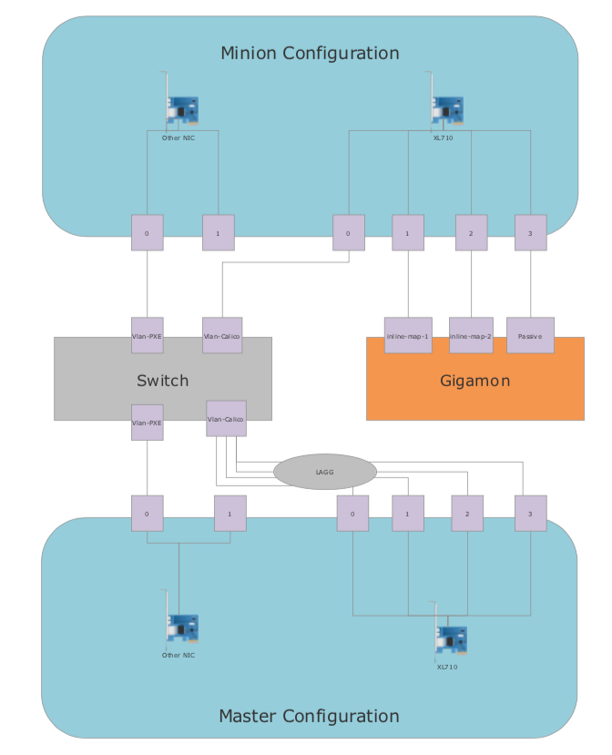

################
Installing EDCOP
################

Prerequisites
=============
In order to begin to install EDCOP the following will be needed:

#. One or more servers that support the following specs:

- A processor and chipset supporting VT-X and VT-D.  These must be enabled in the BIOS.  Refer to your system manufacturer for this.  Dual processor systems are ideal due to to NUMA enhancements.  The more cores the better.
- At least 2x nic ports supporting SR-IOV if using Passive only configuration and 4x nic ports if using inline and passive.  Currently only the Intel XL710 has been tested but others should work.  For an Intel list of supported cards see here: https://www.intel.com/content/www/us/en/support/articles/000005722/network-and-i-o/ethernet-products.html.  
- At least one more nic port for building the system, 1 gbps is fine for this.
- At least two disk volumes, one will install the OS and the other will install additional storage for log analysis and other applications
- A USB thumb drive of 8 GB or more
- Servers should be identical configurations if possible, the Intel network card should be plugged into the exact same PCI-E slot.
- Servers must be set to UEFI in the BIOS

A master server will be chosen and be given a slightly different network configuration than all minions.  The master will be installed using a USB thumb drive.  The minons will be installed using PXE off of the master server.

Network configuration

EDCOP requires a specific network configuration to work properly.  A switch will need to be configured with the following VLANS:

- One vlan to support PXE booting.  This will be tied to all systems
- One vlan to support the Calico Overlay network which will allow the containers in the Kubernetes cluster to communicate.  The master will be connected to this VLAN over a LAGG connection and the minions will have a single port connected to this this.

DNS Requirements
EDCOP requires three DNS entries currently (Eventually only two will be required).  It is recommended to make a seperate sub-domain for the entire cluster.  All servers in the cluster must be able to resolve this as well as the workstations which are accessing services inside of the cluster.

- <subdomain>:       This will point to the network address of the master server
- apps.<subdomain>:  This will also point to the master and be used for the EDCOP marketplace.
- minion addresses:  This can be setup after the  minions are built.  It is reccomended to load balance traffic to  the minions if possible.  In this case, a VIP would be created on a load balancer and then forward requests down to the minions in a round robin fashion.

Building ISO image
==================
This step is optional and will allow you to build .  Download the latest ISO at the releases tab in Github and the "Building ISO Image" step can be skipped.

Note: A workstation with Git, Docker and Make installed in order to build the image.  So far it has been tested to build with both Mac and Linux.  Docker can be installed here https://docs.docker.com/install/

First step will be to build an ISO to install the Master server.  To do this a Docker container has been created that will pull the latest CENTOS and EDCOP packages and build the ISO file necessary to install the master.  

From the workstation run the following commands:

.. code-block:: bash

  git clone https://github.com/sealingtech/EDCOP
  cd EDCOP/
  make iso

Once this process is done you will have an ISO image created in the EDCOP/ directory.  

NOTE: This process will erase EVERYTHING ON THE THUMB DISK!  Make sure there is nothing on the disk.  Make sure you select the correct disk!

To write the ISO to a thumb drive:

On Mac replace the # with the proper number displayed in diskutil list:

.. code-block:: bash

  diskutil list #This will show the list of disks on your systems, find the correct thumb drive disk path (will look something like /dev/disk<#>)
  sudo diskutil unmountDisk /dev/disk<#>
  sudo dd if=EDCOP-dev.iso of=/dev/disk<#>

On Linux

.. code-block:: bash

  fdisk -l #find the name of the device corresponding to your thumb drive
  umount <path to thumb drive>
  sudo dd if=EDCOP-dev.iso of=<path to thumb drive> bs=1m

On Windows (probably works, use Rufus?)

Installing EDCOP
================

When the Master is coming up, ensure it boots to the Thumb drive.  Select "Install the Expandable DCO Platform".

NOTE: This procedure will ERASE everything on the master node and the minion nodes once they are PXE booted.  YOU HAVE BEEN WARNED!

You will be asked if you want to select the default network configuration, generally you will need to select "N" at this point.

#. Enter the hostname, this must be an FQDN and match the DNS record entered earlier.
#. You will be printed an interface list, select Y to team the interfaces for the master
#. Enter in the name of the interfaces seperated by commas for all interfaces included in the LAGG
#. Select "N" for DHCP
#. Enter in the IP address to assign the master (Note, this must match the IP given to the DNS entry)
#. Enter the netmask
#. Enter the gateway
#. Enter the DNS server
#. Enter the interface name of the PXE boot interface
#. Enter in the IP address of the PXE interface.  This will be a non-routed network
#. Enter in the netmask of the PXE interface
#. Enter in the last octet of the starting IP (For example, if your IP address was 10.50.50.10 and you enter in 100 here then your starting IP will be 10.50.50.100)
#. Enter in the last octet of the ending IP
#. Enter Y to accept defaults for network_configuration
#. You will be presented with the disks available on your system.  There will be a number by each of these, Enter in the number of the disk corresponding to the disk you would like to install the OS on
#. Enter in the number you would like to install the rest of the data to

After this process is completed, the master will reboot. You can logon with root and the password open.local.box

There is a systemctl process that runs on first boot, to see the status of this run the command:

.. code-block:: bash

  systemctl status EDCOP-firstboot

Wait until this process is over, the Active setting will go to "inactive (dead)" once this process is completed

To change the root password run the command:

.. code-block:: bash

  passwd

Enter the password twice.

Accessing Cockpit
=================

If you have configured the DNS entry correctly, then Cockpit should be available at this point.  Open a web browser and go to:

https://<hostname of master>/admin/

(Note that the trailing slash is important)

Logon with root as the user and the password you set earlier

Building the Minions
====================

Boot off of the PXE Interface in startup (see system manual for this process)

If the PXE is configured correctly, an Install the Expandable DCO Platform (EDCOP) option will be displayed, select Enter

After the installation process is completed and the system reboots.  Access cockpit and select Cluster -> Nodes and your new node should appear here after a bit.

From the command line, it is also possible to do this from the command line on the master using:

.. code-block:: bash

  kubectl get nodes

Labeling nodes
==============

NOTE: This section will need to change when more granular roles are configured

Nodes must be given roles in order to take certain tasks.  In the Helm charts there are often options to select NodeSelectors.  Log on to the master node and run the command:

.. code-block:: bash

  kubectl label node <name of minion node> nodetype=worker

This process will be repeated for each node.

Datastorage workaround
======================
This is temporary fix in the prototype.

On the master and all minions run:

.. code-block:: bash

  mkdir /EDCOP/bulk/esdata
  chmod 777 /EDCOP/bulk/esdata

Configuring Nodes
=================
An application called host-setup will need to be run in order to configure all the interfaces and neworks.  

Go to apps.<subdomain>

#. Select Deploy one
#. Select Host-setup
#. Select Deploy using Helm

View the Optimization Guide for how to configure interfaces.  If this is EDCOP supported hardware this process will have been done for you.

#. Enter in a name such as hostsetup
#. Select Submit

