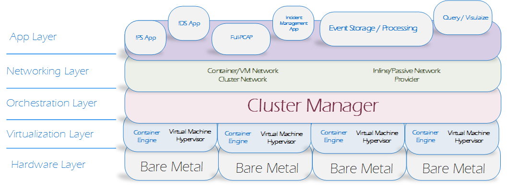

####################
Introducion to EDCOP
####################

What is EDCOP?
==============
The Expandable Defensive Cyber Operations Platform (EDCOP) was designed to be a scalable, 
highly-available, multi-tenant, clustered system used by Cyber Defenders to quickly deploy 
new tools and capabilities.

The goal of EDCOP is to provide a platform that allows users to quickly and easily share and deploy a robust
set of defensive cyber operations tools, while natively handling complex day-2 operations such as scaling out, 
upgrading, and High-Availability.

EDCOP splits the "Platform" from the "Tools". The EDCOP platform provides the high-availability, multi-tenancy, and scalability. These
concepts are abstracted this from the tools themselves. The tools are then installed from remote repositories (like a Cyber Tool App Store).

Project Scope
=============
The overall scope of EDCOP is to create a platform that meets the following needs:

- **Inline and Passive Monitoring:** Sensors can be deployed as either *inline* or *passive* depending on needs of the user
- **Rapid Scalability:** The EDCOP platform should be able to scale-up to hundreds of nodes to support high throughput and storage.
- **High Availability:** The EDCOP platform 
