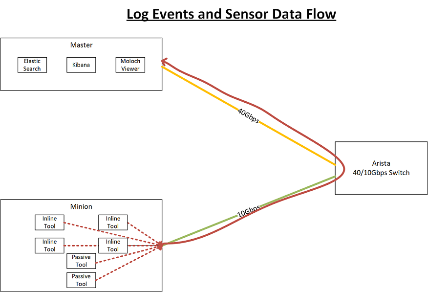

===================================
EDCOP Network Design and Deployment
===================================

.. contents::
	:backlinks: none
	

Bill of Materials
=================

+----------+---------------------------------+---------------------------------------------------------------+
| Quantity | Product                         | Label                                                         |
+==========+=================================+===============================================================+
| 1        | Cisco UCS C240-M5               | - 2 CPUS - Intel Xeon 4110 2.10GHz (8 cores, 16 threads each) |
|          |                                 | - 196 GB of 2400 MHz RAM                                      |
|          |                                 | - 1.7 TB x 10 drives                                          |
|          |                                 | - Nodes (servers)                                             |
+----------+---------------------------------+---------------------------------------------------------------+
| 1        | Arista 7050QX-32S               | Commodity 10/40 Gbps Switch                                   |
+----------+---------------------------------+---------------------------------------------------------------+
| 1        | Juniper EX-3200                 | Commodity 1/10 Gbps Switch                                    |
+----------+---------------------------------+---------------------------------------------------------------+
| 1        | 10Gtek CAB-QSFP/QSFP-P3M        | 40GBase DAC                                                   |
+----------+---------------------------------+---------------------------------------------------------------+
| 5        | 10Gtek CAB-QSFP/4SFP-P3M        | 40Gb to (4) 10Gbps “octopus” or “break-out” cables            |
+----------+---------------------------------+---------------------------------------------------------------+
| 6        | CAT-6 Ethernet Cables           |                                                               |
+----------+---------------------------------+---------------------------------------------------------------+
| 1        | Gigamon Gigavue-HC2 (GVS-HC2A1) | Cards: SMT-HC0-X16, BPS-HC0-D25A4G (Inline/Passive TAP)       |
+----------+---------------------------------+---------------------------------------------------------------+
| 6        | Intel XL710 40Gbps NIC          |                                                               |
+----------+---------------------------------+---------------------------------------------------------------+

The Bill of Materials is used to build our reference architecture. Some assumed materials are:
 - An upstream router to provide gateway and internet connectivity.
 - Server rack with space and redundant power to house all the components.
 
 
Installing the Hardware
=======================
 
Prior to racking and cabling your EDCOP cluster you must first install the Intel XL710 40/10Gbps NICs in each node, update their firmware and configure them to identify each port as a (4) 10Gbps port instead of (1) 40Gbps port.
 
Upgrade the XL710 Firmware
--------------------------
 
Although there are numerous ways to perform the upgrade, it is recommended that the built-in EFI shell is utilized. This process has been verified as working. These instructions assume that is the case.
 
These steps are as follows:
 
1.	Power-off the server and install the Intel XL710-QDA2 card.
2.	Copy the NVMUpdate EFI scripts onto a thumb-drive and insert into the USB port on the server.
3.	Power-on the Server. When prompted, enter the BIOS boot selector menu and choose “EFI Shell” 
4.	Follow the instructions at: https://www-ssl.intel.com/content/www/us/en/embedded/products/networking/nvm-update-tool-quick-efi-usage-guide.html
5.	After this is complete, you may also utilize the Intel QCU utility to change the mode from 2x40 to 4x10.

Converting from 2x40 to 4x10
----------------------------

The Intel XL710-QDA2 cards have two (2) QSFP+ ports. These cards can be utilized as either a single 40Gbps connection (with hot standby) using a QSFP+ to QSFP+ direct connect cable, or as four (4) 10Gbps connections using a break-out cable (also referred to as an octopus cable). This is convenient when connecting the card to a switch that only has 10Gbps interfaces.

**NOTE: Upgrading of the firmware AND drivers must be done BEFORE attempting to change the mode.**

Step for performing this are as follows:

1.	Copy the QCU EFI utility to the thumb-drive. (https://downloadcenter.intel.com/download/25854/Intel-QSFP-Configuration-Utility-EFI-)
2.	Reboot the server and enter the EFI shell. 
3.	Follow the instructions at: https://downloadcenter.intel.com/download/25854/Intel-QSFP-Configuration-Utility-EFI
	- For 2x40Gbps use: ``QCUW64E.EXE /NIC=3 /SET 2x40``
	- For 4x10Gbps use: ``QCUW64E.EXE /NIC=3 /SET 4x10``

Networks
========

.. image:: images/connectivity.png
	:align: center

When all of the components are cabled together it builds a couple small networks. There is a small 1Gbps network used for PXE booting the minions referred to as the “PXE network” (figure 1). A 10/40Gbps network for connecting the minions to the Arista switch called the “cluster network” (figure 2) while only the Master has a 40Gbps connection. No network traffic traverses either of those links, instead, only log events and sensor data traverses the 10/40Gbps backend network. 

.. image:: images/edcop_network.png
	:align: center

PXE Network
-----------

The PXE Network is used by the minions on first boot so they can download the provisioning image from the Master. The PXE Network is not used for management throughout EDCOP.

The management interface from each EDCOP node needs to be connected to a single broadcast domain. For cabling reference figure 1. This can be accomplished by connecting the 1Gb (typically) management interface from all the nodes to a single 1Gbps switch. Best practice is to create a new VLAN on the switch with the description or name “EDCOP-PXE”, and configure all ports connecting to the nodes to pass untagged traffic for that VLAN or as access ports in the specified VLAN.

Once the Master is manually configured, it stands up its own DHCP server. As the minions boot they will request a DHCP address from the Master and begin to download the provisioning image. 

Cluster Network
---------------

The Cluster Network is used for Node to Node communication. It is used to transmit and receive log events and sensor data, generated by the pods on each node back to the Master node. The TAP’d network traffic DOES NOT traverse these links. 

The Minions each connect to the 40/10Gbps switch using the #1 link from the break-out cable from the above Bill of Materials. The Master uses a 40Gbps DAC connection to a 40Gbps interface on the switch.

All the Cluster Network connections from the nodes to the switch should all be in a single VLAN. Best practice is to create a new VLAN on the 40/10Gbps switch with the name or description “EDCOP-CLUSTER” and configure all the Node facing interfaces as access ports or pass untagged traffic for the newly created VLAN.

The EDCOP nodes will require external connectivity to fetch package updates and code/config deltas. You’ll need to configure an uplink to a router or gateway off of the 40/10Gbps switch so each of the nodes can reach-out to the internet or an externally hosted library. This will vary from installation to installation but a simple NAT gateway/boundary will work fine. 

**Please have the upstream gateway defined/provisioned before completing the ‘first-boot’ process on the Master as it will do a network connectivity check before continuing.**

Network TAP Connections
=======================

The tapping infrastructure is an integral part of our architecture. Currently every Minion has 3 connections to the TAP. Each connection uses one of the 3 remaining links from the break-out cable. The TAP itself must have ingress and egress interfaces available for the traffic you require visibility. 

.. image:: images/tap_traffic_1.png
	:align: center
	
As traffic ingresses the TAP from an untrusted/outside network it is load balanced across the Minions using session based persistence. The traffic traverses the tools/sensors on the Minions and is forwarded out towards the Gigamon. As the traffic passes through the Gigamon, to be forwarded towards your inside network, the traffic is TAP’d and sent to the Minions on the 3rd link where the traffic is observed by the passive tools. 

.. image:: images/tap_traffic_2.png
	:align: center
	

Deploy EDCOP as a Virtual Machine
=================================

If a virtual EDCOP is desired, deploying as a Virtual Machine (VM) can be a way to utilize your existing compute and storage resources. The networking stays mostly the same as described throughout this document however the implementation will be different. The example below will outline networking requirements and instructions for deploying EDCOP as a VM in VMware.

Depending on your needs and design you may need to create up to 4 Port-Groups.

- 1 Port-Group for a PXE Boot Network
- 1 Port-Group for EDCOP cluster interfaces
- 1 Port-Group for Inline-Ingress/Passive
- 1 Port-Group for Inline-egress

If you are deploying a “single” EDCOP VM for collecting syslog see architecture below. If there aren’t any other VM’s there is no need for the PXE Network. Also, since this single VM isn’t passing inline traffic, you will not need any additional Network Adapters on the VM. The physical NIC shown below can be a shared NIC, but the best practice is to give it its own physical NIC.

.. image:: images/vm_single_sensor.png
	:align: center
	
If you are considering deploying a sensor such as Suricata or Bro, we recommend deploying 2 VM’s. These VM’s will utilize the 4 Port-Groups referenced above. The “Inline-Ingress/Passive” and “Inline/Egress” interfaces must be their own physical NICs and those NICs must support ‘Promiscuous Mode’. The Cluster Network physical NIC can be a shared port but it is recommended to be its own physical interface. If both VM’s live on the same physical ESXi host, the PXE Network will exist only between VM’s and won’t leave the host. If your VM’s are on different physical hosts you’ll need to make sure the Cluster Network and PXE Network can be reached by both VMs.

**WARNING:** The PXE Network has its own DHCP server. If this is introduced on a shared network segment, it can have adverse effects on existing hosts.

.. image:: images/vm_multiple_sensors.png
	:align: center
	

Appendix
========

Picture References:

.. image:: images/breakout_cable_1.png
	:align: center
	
.. class:: center

*Break-out Cable/Octopus Cable*

.. image:: images/breakout_cable_2.png
	:align: center
	
.. class:: center

*Break-out Cable/Octopus Cable*

.. image:: images/dac_cable.png
	:align: center
	
.. class:: center

*40Gbps DAC Cable*

ERRATA
======

At the time of this writing we recommend using the Intel XL710 NIC per server (https://www.intel.com/content/www/us/en/ethernet-products/converged-network-adapters/ethernet-xl710-brief.html). 

**CAVAET:** You can only use 1 port on the NIC at a time.
