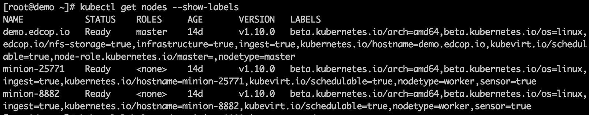
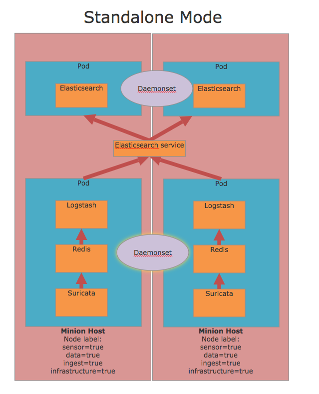
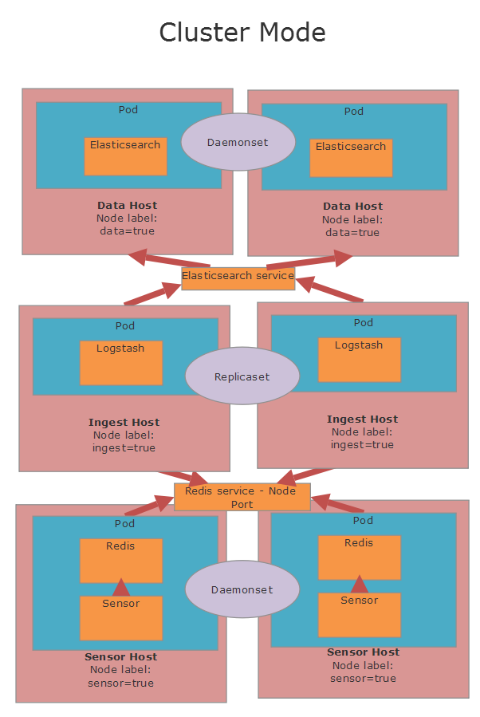
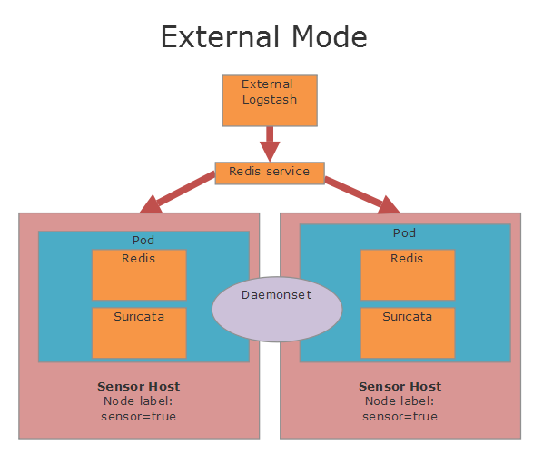

Labeling Nodes
=============
Using **NodeSelectors** labels in Kubernetes is a common practice to influence scheduling decisions, and to determine on which node (or group of nodes) a pod should run. When tools are deployed, they will only deploy to the nodes
with matching labels. Nodes can be assigned multiple labels, based on your individual deployment scenario. Currently 
EDCOP tools work with the following node labels: 

- infrastructure: Used for centralized viewing tools such as Kibana, Moloch. Also used for ELastic Master. This label should be applied to the master node. In a multi-node cluster you would only have 1 infrastructure node.   
- sensor: Used for tools that gather information. Some sensors require for inline/passive to be appropriately configured. Check the documentation for each sensor to view the modes the tools are capable of operating in. 
- data:    Used to store data, needs to have host path defined. 
- ingest:  Used for ingest nodes with tools such as Logstash, Redis.   

You can check current labels for your cluster by running the following command:

.. code-block:: bash

  kubectl get nodes --show-labels

   
   
In our example deployment above master is labeled as infrastructure & ingest. While the worker nodes are labeled as sensor and ingest. You can assign multiple labels, to the different nodes, but it is normally recommended to only label the master node as infrastructure. 

You can label nodes according to your deployment scenario by running the command:

.. code-block:: bash

  kubectl label node <name of minion node> <label=true>
  i.e to label minion-8882 as sensor we would run: 
  kubectl label node minion-8882 sensor=true

Our current tools by default deploy to the following nodes: 

+----------------+---------------------------+
| KIBANA:        |  Deploys to infrastructure|
+----------------+---------------------------+
| ELASTIC MASTER:|  Deploys to infrastructure|
+----------------+---------------------------+
| ELASTIC CLIENT:|  Deploys to data          |
+----------------+---------------------------+
| BRO:           |  Deploys to sensor        |
+----------------+---------------------------+
| SURICATA:      |  Deploys to sensor        |
+----------------+---------------------------+
| MOLOCH VIEWER: |  Deploys to infrastructure|
+----------------+---------------------------+
| MOLOCH CLIENT: |  Deploys to sensor        |
+----------------+---------------------------+
| INGEST:        |  Deploys to ingest        |
+----------------+---------------------------+

Deployment Scenarios:
=============
You can customize this to fit your specific deployment strategy:

-  **Single Node/VM:** Label the node as all of the labels; infrastructure, data, sensor, ingest. 
-  **Small Deployment:** Label the master node as infrastructure, and your worker nodes as everything else.
-  **Large Deployment:** Label the master node as infrastrucuter, label specific nodes to be only sensors, specific nodes to be only ingest, and specific nodes to be only data.

Various Deployment Options:

Standalone Mode
=============

This mode has all services on all systems that are dedicated to the sensor.  Elasticsearch can be on the same system, but this is optional and doesn't need to be the case.  Sensors will gather information and then send directly to Redis on the same physical host in the same pod.  Redis will then store the information where it will be gathered by Logstash, parsed and then sent to the Elasticsearch service.  These connections will then be load balanced to the Elasticsearch instances on the cluster (Can be on the same physical hosts, but not necessary).  In this mode Sensors and the supporting containers (Redis and Logstash) will be deployed to all hosts tagged as sensor=true.  In this mode CPU pinning is necessary for the sensor containers where applicable (Suricata and Bro).  The traffic processing containers will run on a single physical CPU and all the other containers will run on another.  Sensors can be load balanced easily in this mode.  See the guide on CPU pinning for more information.

Cluster Mode
=============
Cluster mode is designed for allowing your cluster to scale in a more controllable manner.  In this mode it is possible to scale out the sensors and the data ingest layers separately.  Sensors will reside on a dedicated host and then information will be sent to a separate set of systems dedicated for data ingest.  Sensors can be load balanced if desired, but don't have to be.  It is also possible to have sensors deployed in multiple locations across the network.

External Mode
=============
External mode allows for data to be sent outside of the Kubernetes cluster into any Redis instance.  Redis can be hosted on an another Kubernetes cluster (Such as another EDCOP cluster deployed in another location that is reachable through a VPN).

