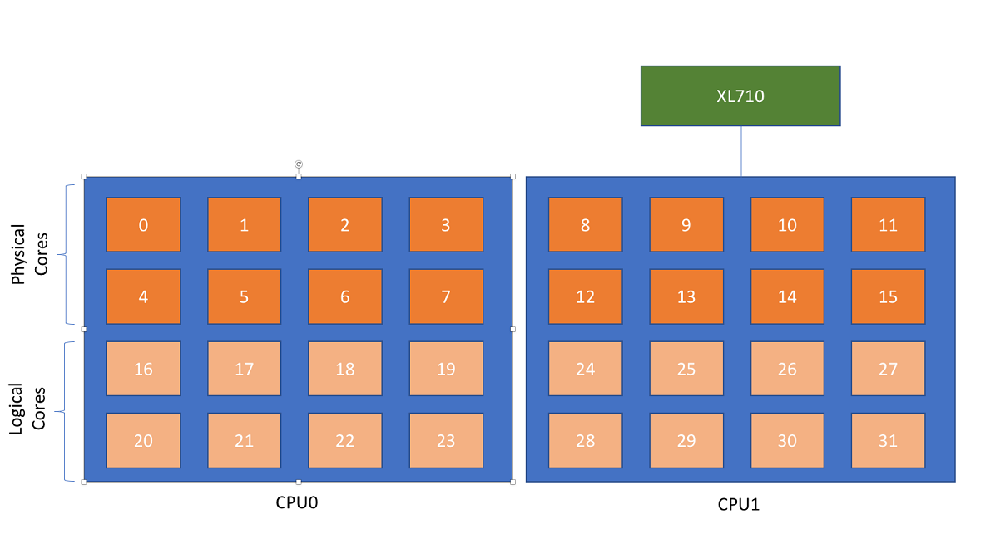
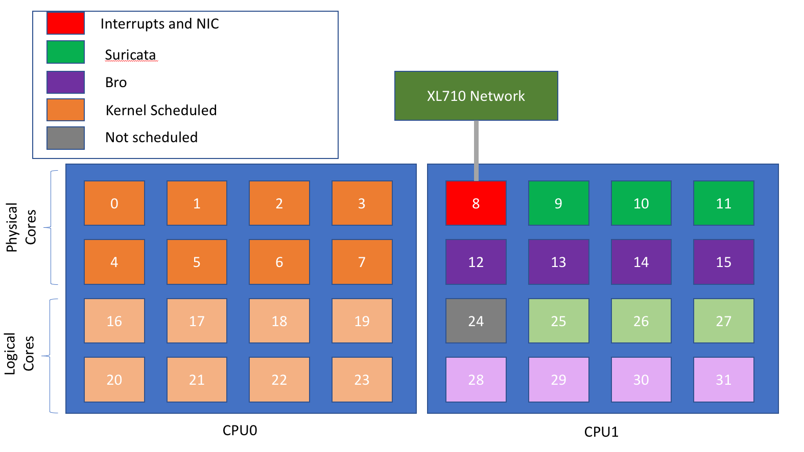

########################
Performance Optimization
########################

Understanding CPU topology
==========================

Going on to a minion and executing lscpu will show you the CPU topology of a specific system.  The NUMA node0 and NUMA node1 values show the specific CPU core layout of each system.  In the below example CPU Node0 utilizes core 0-7 for the real cores, 16-23 are the hyperthreaded cores on that CPU.

::

  [root@minion-20699 ~]# lscpu
  Architecture:          x86_64
  CPU op-mode(s):        32-bit, 64-bit
  Byte Order:            Little Endian
  CPU(s):                32
  On-line CPU(s) list:   0-31
  Thread(s) per core:    2
  Core(s) per socket:    8
  Socket(s):             2
  NUMA node(s):          2
  Vendor ID:             GenuineIntel
  CPU family:            6
  Model:                 85
  Model name:            Intel(R) Xeon(R) Silver 4110 CPU @ 2.10GHz
  Stepping:              4
  CPU MHz:               826.382
  CPU max MHz:           3000.0000
  CPU min MHz:           800.0000
  BogoMIPS:              4200.00
  Virtualization:        VT-x
  L1d cache:             32K
  L1i cache:             32K
  L2 cache:              1024K
  L3 cache:              11264K
  NUMA node0 CPU(s):     0-7,16-23
  NUMA node1 CPU(s):     8-15,24-31

Next, find which NUMA node your specific adapter is tied to.  To do this, run the below command.  This will show the cpu cores that the network adapter is tied to specifically which in our example ties to NUMA node1. 

::

  [root@minion-20699 ~]# cat /sys/class/net/enp216s0f3/device/local_cpulist
  8-15,24-31

From this information you can now begin to make informed decisions for configuring the sensors.  The sensors in this example will be configured to execute on cores 8-15 and 24-31 and everything else will be configured to execute on 0-7 and 16-23.

Isolating CPUS
==============

The first step of properly tuning the minions is setting the isol_cpus option on any minion which will be hosting sensors.  This will tell the Linux kernel to not schedule any processes to these cores.  The isolated cores will then be reserved for the sensors which will be manually assigned when setting up the sensors.

On each minion this will need to be done:
TODO: integrate with the installer.
Modify the below command to contain the CPUs connected to your network interface card.  Then run this command on all systems.

.. code-block:: bash

  if grep -q isolcpus /etc/default/grub
  then
    echo "Already set, not doing anything"
  else
    echo "setting isolcpus"
    sed -i s/"quiet"/"quiet isolcpus=8,9,10,11,12,13,14,15,24,25,26,27,28,29,30,31"/ /etc/default/grub
  fi

  grub2-mkconfig -o /boot/efi/EFI/centos/grub.cfg
  grub2-mkconfig -o /boot/grub2/grub.cfg

Finally, reboot the system

.. code-block:: bash

  shutdown -r now

After the system reboots you can verify the effect has taken place and verify the cores you have selected to be isolated are on this list.

.. code-block:: bash

  cat /sys/devices/system/cpu/isolated

From this information our NUMA assignments look like the following picture.

Planning your deployment
========================

Armed with the information above it is now important to begin planning your deployment of tools.  Proper planning will ensure resources utilized to the best of their abilities.  There are a couple of key rules to abide by:

#. Sensors should be dedicated cores for efficient processing of network traffic.  This means each core will be tied to a specific sensor role and do nothing else
#. A dedicated core will process network interrupts
#. The cores utilized for both of these should be on the same numa node as the network card
#. All sensor nodes should have similar hardware which will include the CPU configuration and network interface configuration.  If this isn't possible it will be necessary to deploy different configurations for each piece of hardware.

This guide will help your configure these settings.  

Configuring sensor minions
==========================

Host-setup is a tool which will configure hosts on boot.  The pod lives in the kube-system namespace. This pod will launch, run a number of commands and then do nothing until the host reboots at which point it will run again.  It is possible to run this tool again while systems are on, but this should be avoided unless all sensors are turned off first as it will effect traffic flows on existing sensors.  You will need to know which network interface cards 

Open up the EDCOP marketplace and select configure sensors and select "Deploy using Helm".  Give the deployment any name.  
  
You must define the interfaces that will be used for inline1, inline2 and the passive network.  These network interface cards must support SR-IOV.  Define the number of virtual functions that will be created on the network port.  The IRQCoreAssignment will be the processor core that will process the IRQs for packets coming in to the interface.  You should ensure that this core is in the same NUMA node as the network interface card and that it will not have any other sensor scheduled to it.  The dedicated job of this core will be to handle interrupts.

The final layout of CPUs will look something like the below picture

.. code-block:: yaml
  :linenos:
  
  networkInterfaces:
      inline1interface:
          deviceName: enp216s0f1
          numOfVirtualFunctions: 4
          irqCoreAssignment: 8
      inline2interface:
          deviceName: enp216s0f2
          numOfVirtualFunctions: 4
          irqCoreAssignment: 8
      passive1interface:
          deviceName: enp216s0f3
          numOfVirtualFunctions: 4
          irqCoreAssignment: 8
  nodeSelector:
    nodetype: worker

Once this is done select Submit.  This process only needs to be done once unless changes are needed.  If ever in the future a change is needed delete all sensors first then delete the capability and recreate configure-sensors and redeploy inline and passive sensors.  If heart beats are configured properly on the load balancer traffic will be minimally effected during this period, though passive and inline capabilities will not function during that time.
