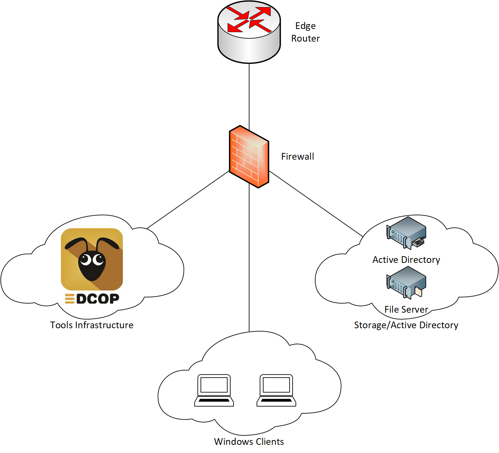
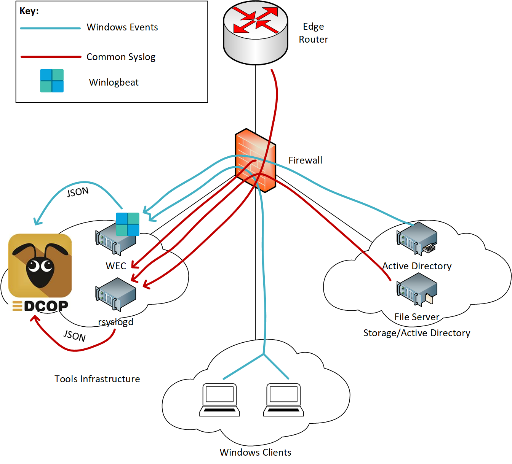
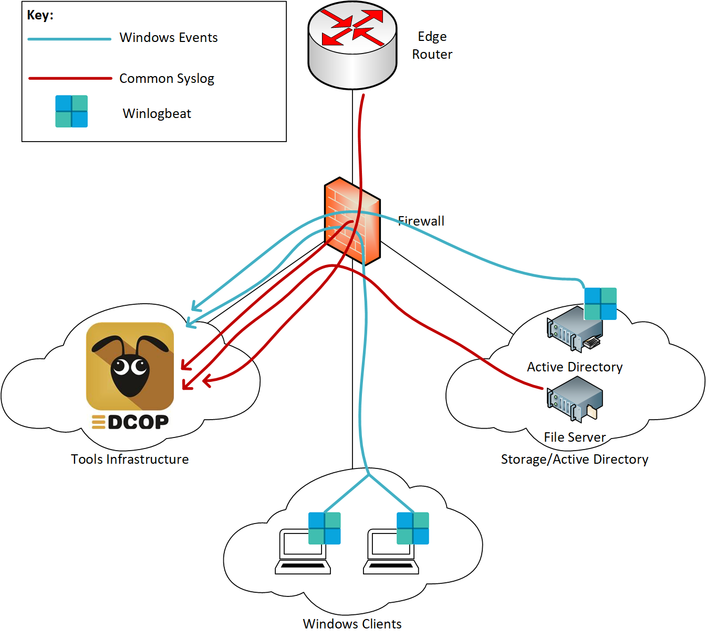
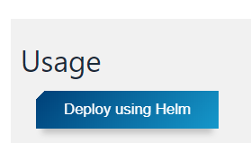

=========================================================
Deploying EDCOP for a Scalable Logging and Visualizations
=========================================================

Overview
========

Centralized logging is the cornerstone of any great network or security operations. EDCOP was built to support the scaling needs of large organizations and growing networks as well as the ease of push-button deployment for organizations with smaller networks and fewer staff. 

EDCOP can be deployed as a single VM or as a cluster of hardware servers. Using either choice the deployment model and process is similar.

Reference Topology
==================

The below architecture is a simplified network architecture incorporating common network elements such as firewall and VLAN segmentation. You need to get logs from the devices in the windows clients and the storage/active directory network segments into EDCOP which is in another segment. To do this you will need routing between the source and destination network segments as well as permit statements for the ports and protocols used to carry the log events.

Syslog Design Architecture
==========================

Before you deploy EDCOP you should survey your network and decide from which devices you would like to gather logs. There are many industry standard and popular ways to get logs and events to your centralized logger. You’ll need to decide which works best for your organization. In the below outline we discuss 2 methods to forward and ingest Windows Events and syslog from common networking devices. 

1.	Syslog and Event Aggregators and Remote Forwarders
------------------------------------------------------
For Windows events you can use Windows Event Forwarding (WEF), which is a service that runs on every Windows client device. It is driven by Windows Group Policy to forward log/events to a Windows Event Collector (WEC). The WEC is a Windows Server whose role it is to collect events from WEF clients. This can be a service running on an existing Windows Server but, to prevent resource starvation we recommend making the WEC a standalone server. On the WEC you can install Winlogbeat, which is a light weight log/event forwarder which will forward logs/events into ELK stack pipeline on EDCOP.

For common syslog from networking devices and linux servers you can first forward your syslog to a rsyslog server which from there can convert the logs/events into json and send to Logstash in the ELK stack on EDCOP.

This is a highly scalable model designed for large organizations who can support the additional resource and financial overhead of deploying and managing additional servers in your network.

2.	Forward Directly to EDCOP
-----------------------------
Most networking devices such as routers, switches and firewalls can be configured to send syslog to a remote server. For devices such as Windows workstations and servers we recommend Winlogbeat from Elasticsearch. Winlogbeat is an agent that when installed on the end-hosts, forwards logs to a remote syslog server. To install Winlogbeat we recommend following the standard Winlogbeat installation guide (https://www.elastic.co/downloads/beats/winlogbeat).

This model is recommended for small deployments or small organizations who don’t have the additional resources to manage the additional resources for a large deployment.

Understanding the EDCOP Ingest Pipeline
=======================================
There are many internal components that process the data before you can visualize or search it via Kibana. An understanding of the components is suggested to understand how the events are processed. Your syslog and events will be forwarded to your EDCOP instance using TCP/UDP port 30144 by default. This is configurable via helm chart at the time of deployment. Once your event is received it is processed by Logstash on one of the minions. Meta-data is generated and an event is indexed in Elasticsearch. You can use Kibana to visualize and search for events.

incoming syslog/event -> EDCOP TCP/UDP 30144 -> Logstash -> Elasticsearch -> Kibana

Install EDCOP
=============
To access the latest installation instructions for EDCOP navigate to GitHub: https://github.com/sealingtech/EDCOP.

After EDCOP is installed you can deploy ELK.

Once EDCOP is running, you must label the node by running the following commands. 

-  ``kubectl label nodes <node-name> <label-key>=<label-value>``
-  For your specific installation you will need to label the node as infrastructure, and ingest. This can be accomplished using the following: 

   -  Kubectl label master nodes: ``infrastructure=true``
   -  Kubectl label master nodes: ``ingest=true``
-  By default the node will be labeled master. Node-name in this instance was master.edcop.io, this will vary depending on the FQDN that is used. 
-  You can verify that the node is labeled appropriately by running: ``kubectl get nodes --show-labels``

If deploying a multi node cluster, you must label each node appropriately based on which tools you want deployed to which node, available labels are:

-  sensor=true, data=true, ingest=true, infrastructure=true, nodetype=master

SYSLOG NodePort
===============
It is important to note that EDCOP’s Ingest will be listening on port 30144 for TCP/UDP syslog events. This is configurable during deployment. Please make sure your source devices have a path to the EDCOP Master and the destination port you specify is allowed through the network (TCP/UDP 30144 by default). If you cannot use port 30144 because another application is using it in your network, you may specify another port in the range of 30000 – 32767.

Deploy ELK and Ingest Using Kubeapps
====================================
ELK is multiple pieces of software comprised of Elasticsearch, Logstash and Kibana, together they make up the system referred to as ELK. All application deployment is managed through Kubeapps. Navigate to Kubeapps by visiting: **https://apps.<your-master>.<your-domain>.<tld>**

Example: https://apps.master.edcop.io

You can install an application by selecting each one at a time on the EDCOP capabilities dashboard and on the following screen using the “Deploying using Helm” button in the upper right. You must give the application a name. This will deploy the applications with their configured defaults. These applications will work out of the box or you can apply specific customizations by modifying the HELM charts prior to deployment. For configuration instructions see the GitHub: https://github.com/sealingtech/EDCOP-INGEST

Please install the following applications to ingest, process and visualize incoming syslog events and log data.

1.	Elasticsearch
2.	Kibana
3.	Ingest

Send logs to EDCOP
==================
Please consult the vendor documentation when configuring syslog from networking devices/appliances and host systems.

A couple examples for forwarding log events from popular networking devices can be found below:

Cisco 3750x
-----------
Where “A.B.C.D” is the IP address of your EDCOP master:

.. code-block::

  Switch(config)# logging trap notifications
  Switch(config)# logging host A.B.C.D transport udp port 30144

Cisco ASA
---------
Where “interface_name” is the interface sourcing the syslog messages. Typically, this will be the management interface. “ip_address” is the IP address of your EDCOP master. Either transport protocol may be used but the default port is 30144 for EDCOP.

.. code-block::

  CiscoASA(config)# logging enable
  CiscoASA(config)# logging host interface_name ip_address [tcp[/port] | udp[/port]]
  CiscoASA(config)# logging trap notifications

Verify Received Logs
====================
Log in to a SSH or terminal session on the EDCOP master. Get the name of the Logstash pod. Check for logs on EDCOP for the Logstash pod.

SSH/Terminal into EDCOP master -> Get name of Logstash pod -> Check logs for Logstash pod

To find the names of your pods, run the following on the master server:

.. code-block:: bash

  [root@master ~]# kubectl get pods
  NAME                                           READY     STATUS    RESTARTS   AGE
  default-elasticsearch-elasticsearch-0          1/1       Running   0          20h
  default-elasticsearch-elasticsearch-1          1/1       Running   0          20h
  default-elasticsearch-elasticsearch-master-0   1/1       Running   0          20h
  default-ingest-ingest-logstash-29jnj           1/1       Running   0          19h
  default-ingest-ingest-logstash-4p6fr           1/1       Running   0          19h
  default-ingest-ingest-redis-49h2v              1/1       Running   0          19h
  default-ingest-ingest-redis-nkpbv              1/1       Running   0          19h
  default-kibana-kibana-7ff867c7bf-h9gvr         1/1       Running   0          19h

To verify logstash is receiving events, choose the name of a Logstash pod and use the command below. 
You should be receiving logs similar to this if Logstash is receiving events.

.. code-block:: bash

  [root@master ~]# kubectl logs default-ingest-ingest-logstash-29jnj
  {
        "syslog_message" => "2018/07/12 13:44:40 [error] 15741#100129: *27812 open() \"/usr/local/www/wsman\" failed (2: No such file or directory), client: 172.16.0.12, server: , request: \"POST /wsman HTTP/1.1\", host: \"*.*.*.*\"",
                  "type" => "syslog",
        "syslog_program" => "nginx",
              "@version" => "1",
      "syslog_timestamp" => "Jul 12 13:44:40",
           "received_at" => "2018-07-12T13:44:40.242Z",
       "syslog_hostname" => "pfchangs.st.lab",
               "message" => "<171>Jul 12 13:44:40 pfchangs.st.lab nginx: 2018/07/12 13:44:40 [error] 15741#100129: *27812 open() \"/usr/local/www/wsman\" failed (2: No such file or directory), client: 172.16.0.12, server: , request: \"POST /wsman HTTP/1.1\", host: \"*.*.*.*\"",
         "received_from" => "10.244.128.128",
            "@timestamp" => 2018-07-12T13:44:40.000Z,
                  "host" => "10.244.128.128"
  }

Grok parse errors are very common depending on the input source of your syslogs. 
You can find other Logstash pipeline configs that better match the format of your logs online. 

.. code-block:: bash

  [root@master ~]# kubectl logs default-ingest-ingest-logstash-29jnj
  {
         "message" => "<190>Jul 12 14:15:26 dhcpd: DHCPREQUEST for 172.16.100.52 from 00:50:56:8d:8a:aa (minion-4140) via em4",
            "type" => "syslog",
        "@version" => "1",
            "tags" => [
          [0] "_grokparsefailure"
      ],
      "@timestamp" => 2018-07-12T14:15:26.194Z,
            "host" => "10.244.128.128"
  }

If you are not receiving logs jump to troubleshooting. If you are receiving logs continue to Visualize Logs/Events

Visualize Logs/Events
=====================
Navigate to: https://kibana.<your-domain>.<tld>/kibana

Troubleshooting/Not receiving Logs
==================================
If you are not receiving logs your course of troubleshooting will be verifying various stages, see blow:

-	Verify the source is sending logs via Packet Capture at the source or in the data path.
- Verify the source configuration matches the Ingest configuration on EDCOP. (Example: UDP port 30144)
- Verify reachability between the source and destination.
- Verify the destination, EDCOP, is receiving the logs via Packet Capture.
- Verify the destination port in the packet capture matches the Ingest configuration.
- Verify these pods are up, deployed, working and stable:

  - Elasticsearch
  - Logstash
  - Redis
  - Kibana

